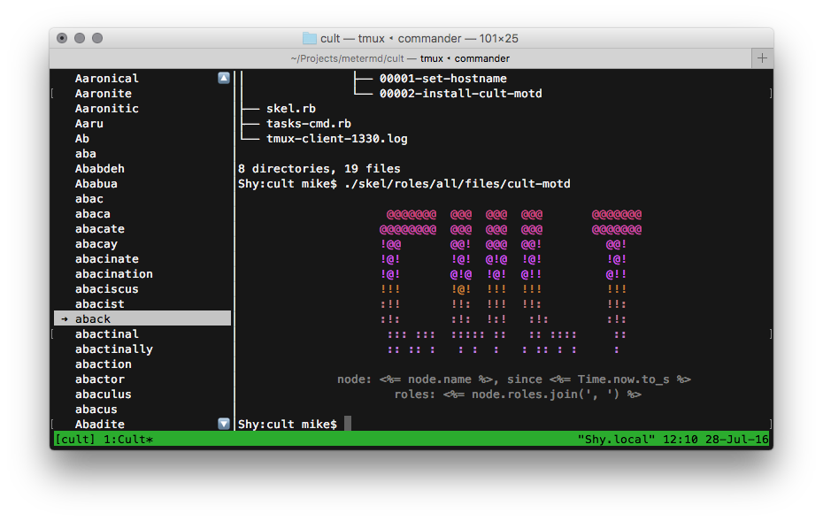

# listpager

## Introduction
listpager is a terminal listbox.  It reads `stdin` for a list of items, goes all
interactive, and writes events to `stdout` as the user interacts with it.



*listpager is in the left-hand panel*

listpager has proportional scroll bars, and can handle lists of any length.  It
handles terminal resizing just fine.

listpager was written as a component of [Cult][1], a fleet management tool.  Cult's
interactive mode is a specially-crafted tmux session consisting of tools that
talk to each other.  listpager is the node selection widget.

So basically, you may want to `popen` listpager, print a list of somethings to
its `stdin`, and listen on its `stdout`.

```ruby
listpager = IO.popen('listpager', 'r+')

# You don't want buffered IO
listpager.sync = true

50.times do |i|
  listpager.puts "Item #{i}"
end

# Enter command mode.
listpager.puts "%%"
listpager.puts "select 35"
```

## Protocol
listpager reads each item from stdin, and it becomes a list item.  As the user
arrows through the list, it outputs messages like:

`select 21 apples` where `21` is the index into the list, and `abacate` is the
caption.  Any other keys pressed on an item are written out like
`keypress enter apples`.

listpager stops considering input bulk list items once it sees: `%%`, where it
enters command mode.  Currently, command mode does nothing, but in the future,
it will allow the calling program to instruct listpager to select certain items,
ask for statuses, manipulate the list, add badges, change captions, etc.


## Dependencies and Installation
listpager requires Ruby, and the `ncurses-ruby` gem.  It'll be properly packaged
when it has a bit more functionality.


## Implementation Notes
curses is terrible but portable.  'curses' doesn't expose enough to be useful,
'ncurses-ruby' is about as good as you'll do in Ruby.


## Upcoming Features
Right now, listpager does exactly what Cult needs, and nothing more.  For it to
be more functional, I'd like to add a few features:

  * `listpager -1`, for displaying a list and just outputting the one item the
    user selected with enter, ala Zenity/dialog.
  * A search/filter activated with the `/` key
  * Mouse support, with scroll wheels.
  * Checkboxes
  * Extend command mode


## Contributing
I'm trying to keep listpager a single-file, small project, preferably under 500
lines of code. If you use listpager and know Ruby, please dig in and PR.


## License
listpager is released unter the MIT license.


## Authors
listpager was written by Mike A. Owens at meter.md.  mike@meter.md

[1]: https://github.com/metermd/cult "Cult"
