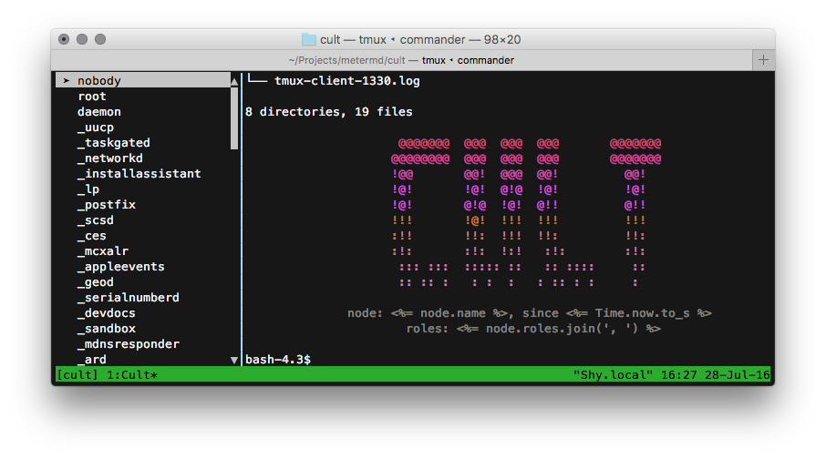

# listpager

## Introduction
listpager is a terminal listbox.  It reads `stdin` for a list of items, goes all
interactive, and writes events to `stdout` as the user interacts with it.



*listpager is in the left-hand panel*

listpager has proportional scroll bars, and can handle lists of any length.  It
handles terminal resizing just fine.

listpager was written as a component of [Cult][1], a fleet management tool.  Cult's
interactive mode is a specially-crafted tmux session consisting of tools that
talk to each other.  listpager is the node selection widget.

So basically, you may want to `popen` listpager, print a list of somethings to
its `stdin`, and listen on its `stdout`.

```ruby
listpager = IO.popen('listpager', 'r+')

# You don't want buffered IO
listpager.sync = true

50.times do |i|
  listpager.puts "Item #{i}"
end

# Enter command mode.
listpager.puts "%%"
listpager.puts "select 35"
```

If you want to play with the protocol, it's easiest to use two terminals and
`socat` (some implementations of `nc`/`netcat` do weird FD juggling which
ends up sending raw keyboard character input back to the client.).

Set up one like:

```bash
socat TCP-LISTEN:4500,reuseaddr EXEC:'listpager'
```

And a "client", like:
```bash
socat TCP:localhost:4500 -
```

Add some items on your keyboard, then enter `%%` to enter command mode.  Another
`%%` will put you back in command mode.  If you need a literal `%%` list item,
escape it with `\%%`.  If you need a literal `\\%%`, you're out of luck, because
complete escaping isn't available yet.

There are a lot of obvious things the protocol could do, that it doesn't
currently.  It's way low-hanging fruit for any contributors (`clear`, `rename`,
`move`, etc.)

## Protocol
listpager reads each item from stdin, and it becomes a list item.  As the user
arrows through the list, it outputs messages like:

`select 21 apples` where `21` is the index into the list, and `abacate` is the
caption.  Any other keys pressed on an item are written out like
`keypress enter apples`.

listpager stops considering input bulk list items once it sees: `%%`, where it
enters command mode.  Currently, command mode does nothing, but in the future,
it will allow the calling program to instruct listpager to select certain items,
ask for statuses, manipulate the list, add badges, change captions, etc.


## Dependencies and Installation
Install listpager with `gem install listpager`.  It has few dependencies:
currently only `ncurses-ruby`.


## Implementation Notes
curses is terrible but portable.  'curses' doesn't expose enough to be useful,
'ncurses-ruby' is about as good as you'll do in Ruby.


## Upcoming Features
Right now, listpager does exactly what Cult needs, and nothing more.  For it to
be more functional, I'd like to add a few features:

  * `listpager -1`, for displaying a list, and just outputting the first item
    the user selected with enter, ala Zenity/dialog.
  * A search/filter activated with the `/` key
  * Mouse support, with scroll wheels.
  * Checkboxes
  * Extend command mode


## Contributing
~~I'm trying to keep listpager a single-file, small project, preferably under
500 lines of code.~~ I've given up on the idea that this can be functional,
correct, and maintainable in a single file that can be copied to a bin
directory. If you use listpager and know Ruby, please dig in and PR at its
github: https://github.com/mieko/listpager


## License
listpager is released under the MIT license.  Check out LICENSE.txt


## Authors
listpager was written by Mike A. Owens at meter.md.  mike@meter.md

[1]: https://github.com/metermd/cult "Cult"
